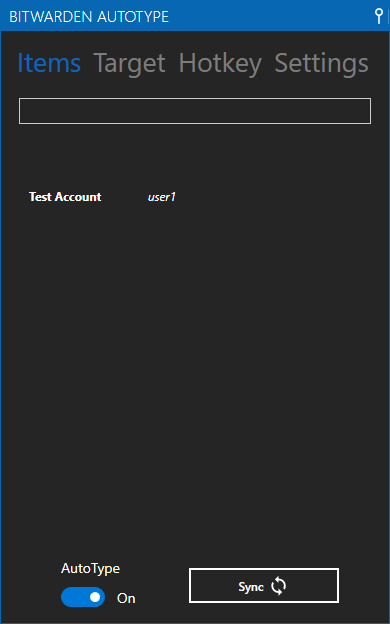
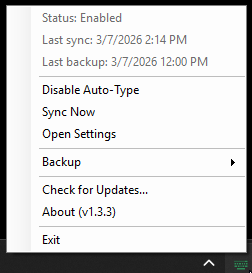
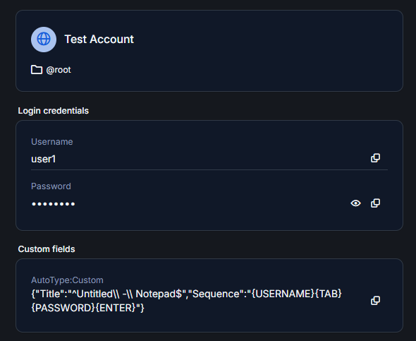
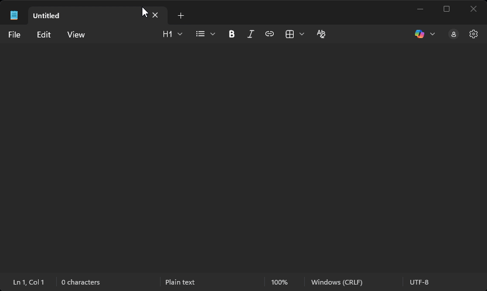

# Bitwarden AutoType for Windows

> **Platform:** Windows 10 / Windows 11 Only

A powerful desktop application that brings KeePass-style auto-type functionality to Bitwarden on Windows. Automatically fill credentials into any application using customizable keyboard shortcuts and intelligent window detection.


<!-- TODO: Add screenshot of main window -->

## ✨ Features

- 🔐 **Auto-Type**: Automatically fill credentials using customizable keyboard sequences
- 🎯 **Smart Window Targeting**: Match by window title, process name, or class name with regex support
- 🔢 **TOTP Support**: Generate and auto-type time-based one-time passwords
- 🛡️ **Smart Elevation**: Runs without admin by default, auto-detects when elevation is needed (RDP, UAC)
- 💾 **Encrypted Backups**: Scheduled vault backups with AES-256-GCM encryption
- 🔄 **Auto-Updates**: Automatic update checks and seamless installation
- 📌 **System Tray**: Runs in background with customizable hotkey trigger

---

## 📋 System Requirements

| Requirement | Details |
|------------|---------|
| **Operating System** | Windows 10 (1809+) or Windows 11 |
| **Runtime** | .NET 10.0 Runtime (included in installer) |
| **Bitwarden Account** | Cloud (bitwarden.com) or self-hosted instance |
| **Disk Space** | ~50 MB |
| **Permissions** | User-level (admin not required for most use cases) |

---

## 📥 Installation

### Step 1: Download the Installer

1. Go to the [Releases](https://github.com/modarken/Bitwarden-PowerTools/releases) page
2. Download the latest `Bitwarden.AutoType-win-Setup.exe`


<!-- TODO: Add screenshot of GitHub releases page -->

### Step 2: Run the Installer

1. Double-click `Bitwarden.AutoType-win-Setup.exe`
2. Click **Yes** if Windows User Account Control prompts you
3. Follow the installation wizard


<!-- TODO: Add screenshot of installer -->

### Step 3: Launch the Application

The application will start automatically after installation and appear in your system tray.


<!-- TODO: Add screenshot of system tray icon -->

---

## 🚀 Quick Start Guide

### First-Time Setup

#### 1. Open Settings

Right-click the system tray icon and select **Settings**.


<!-- TODO: Add screenshot of tray menu -->

#### 2. Configure Bitwarden Connection

In the Settings window:

1. **Server URL**: Enter your Bitwarden server URL
   - Cloud: `https://vault.bitwarden.com`
   - Self-hosted: Your server address (e.g., `https://bitwarden.mycompany.com`)

2. **Email**: Your Bitwarden account email

3. **API Credentials**: 
   - Log in to your Bitwarden web vault
   - Go to **Settings** → **Security** → **Keys**
   - Copy **Client ID** and **Client Secret**
   - Paste them into the application

4. Click **Test Connection** to verify


<!-- TODO: Add screenshot of settings with connection details -->

#### 3. Configure Hotkey (Optional)

1. In Settings, go to the **Hotkey** section
2. Set your preferred keyboard shortcut (default: `Ctrl+Shift+A`)
3. Click **Save**


<!-- TODO: Add screenshot of hotkey configuration -->

---

## 📖 How to Use

### Basic Auto-Type

#### Step 1: Configure Auto-Type for a Bitwarden Entry

1. Open your Bitwarden web vault or desktop app
2. Select the entry you want to configure (e.g., "Gmail")
3. Scroll to **Custom Fields**
4. Click **+ New Custom Field**
5. Set:
   - **Name**: `AutoType:Custom`
   - **Type**: Text
   - **Value**: JSON configuration (see below)


<!-- TODO: Add screenshot of Bitwarden custom field -->

#### Step 2: Configure the Auto-Type Sequence

Paste this JSON into the **Value** field (customize as needed):

```json
{
  "Target": "^.*Gmail.*$",
  "Type": "Title",
  "Sequence": "{USERNAME}{TAB}{PASSWORD}{ENTER}"
}
```

**Explanation:**
- **Target**: Regex pattern to match window title (e.g., `^.*Gmail.*$` matches any window with "Gmail" in the title)
- **Type**: Matching method (`Title`, `Process`, or `Class`)
- **Sequence**: What to type (see [Keyboard Sequences](#keyboard-sequences) below)

#### Step 3: Use Auto-Type

1. Open the target application (e.g., Gmail login page in browser)
2. Click on the username/password field
3. Press your configured hotkey (default: `Ctrl+Shift+A`)
4. Your credentials will be automatically typed!


<!-- TODO: Add animated GIF of auto-type working -->

---

## ⚙️ Configuration

### Keyboard Sequences

Build custom sequences using these placeholders:

| Placeholder | Description | Example |
|------------|-------------|---------|
| `{USERNAME}` | Bitwarden username/email | `user@example.com` |
| `{PASSWORD}` | Bitwarden password | `your-password` |
| `{TOTP}` | Time-based OTP (if configured) | `123456` |
| `{NAME}` | Entry name | `Gmail Account` |
| `{URL}` | Entry URL | `https://gmail.com` |
| `{NOTES}` | Entry notes | (your notes) |
| `{CUSTOM:FieldName}` | Custom field value | Value of custom field |
| `{TAB}` | Tab key | Moves to next field |
| `{ENTER}` | Enter key | Submits form |
| `{SHIFT}` | Shift modifier | Next key pressed with Shift |
| `{CTRL}` | Ctrl modifier | Next key pressed with Ctrl |
| `{ALT}` | Alt modifier | Next key pressed with Alt |
| `{DELAY=1000}` | Wait 1000 milliseconds | Pauses typing |

**Example Sequences:**

```json
// Simple login
{
  "Target": "^.*Login.*$",
  "Type": "Title",
  "Sequence": "{USERNAME}{TAB}{PASSWORD}{ENTER}"
}

// Login with TOTP
{
  "Target": "^.*Two-Factor Authentication.*$",
  "Type": "Title",
  "Sequence": "{TOTP}{ENTER}"
}

// Complex multi-step form
{
  "Target": "^.*Registration.*$",
  "Type": "Title",
  "Sequence": "{CUSTOM:FirstName}{TAB}{CUSTOM:LastName}{TAB}{USERNAME}{TAB}{PASSWORD}{TAB}{PASSWORD}{ENTER}"
}

// With delays for slow forms
{
  "Target": "^.*Slow Form.*$",
  "Type": "Title",
  "Sequence": "{USERNAME}{DELAY=500}{TAB}{DELAY=500}{PASSWORD}{DELAY=1000}{ENTER}"
}
```

### Window Targeting

Match windows using three different methods:

#### 1. Title (Recommended)

Matches the window title using regex:

```json
{
  "Target": "^.*Notepad.*$",
  "Type": "Title"
}
```

**Common Patterns:**
- `^.*Chrome.*$` - Any window with "Chrome" in the title
- `^Login - ` - Windows starting with "Login - "
- `Gmail.*Mozilla Firefox$` - Gmail tab in Firefox

#### 2. Process Name

Matches the executable name:

```json
{
  "Target": "chrome.exe",
  "Type": "Process"
}
```

#### 3. Window Class

Matches the window class (advanced):

```json
{
  "Target": "Chrome_WidgetWin_1",
  "Type": "Class"
}
```

---

## 🛡️ Security Considerations

### Credential Storage

- ✅ API credentials are encrypted using **Windows DPAPI**
- ✅ Settings stored in `%LocalAppData%\Bitwarden-PowerTools`
- ✅ Never stored in plaintext
- ✅ Protected by your Windows user account

### Self-Hosted Bitwarden Servers

If you're using a self-hosted Bitwarden instance with a self-signed or untrusted SSL certificate:

1. Open **Settings**
2. Check **Allow Invalid SSL Certificates** ⚠️
3. Click **Save**

⚠️ **Security Warning**: Enabling this option bypasses SSL certificate validation. Only use with self-hosted servers you trust.

**For maximum security**: Keep this option disabled when connecting to cloud Bitwarden or servers with valid SSL certificates.

For more details, see [@docs/SSL-Certificate-Configuration.md](@docs/SSL-Certificate-Configuration.md).

### Elevation Detection

The application runs **without administrator privileges** by default. 

When it detects a protected window that requires elevation (e.g., RDP credential dialog, UAC prompt, Windows Security), it displays a warning banner:


<!-- TODO: Add screenshot of elevation warning banner -->

Click **Restart as Administrator** to enable auto-type for these protected windows.

---

## 🔧 Advanced Features

### Scheduled Vault Backups

Configure automatic encrypted backups of your Bitwarden vault:

1. Open **Settings** → **Backup**
2. Enable **Scheduled Backups**
3. Set backup frequency and location
4. Backups are encrypted with AES-256-GCM


<!-- TODO: Add screenshot of backup settings -->

### Multiple Auto-Type Configurations

You can add multiple `AutoType:Custom` fields to a single Bitwarden entry for different windows:

```json
// Custom Field 1: AutoType:Custom
{
  "Target": "^.*Login Page.*$",
  "Type": "Title",
  "Sequence": "{USERNAME}{TAB}{PASSWORD}{ENTER}"
}

// Custom Field 2: AutoType:Custom2
{
  "Target": "^.*Admin Panel.*$",
  "Type": "Title",
  "Sequence": "{CUSTOM:AdminUser}{TAB}{PASSWORD}{ENTER}"
}
```

---

---

## ❓ Troubleshooting

### Auto-Type Not Working

**Problem**: Nothing happens when I press the hotkey.

**Solutions:**
1. ✅ Check that auto-type is enabled:
   - Right-click tray icon → **Toggle Auto-Type** (should show checkmark)
2. ✅ Verify the hotkey isn't conflicting:
   - Try changing to a different hotkey in Settings
3. ✅ Check window targeting:
   - Right-click tray icon → **Current Window Info** to see window title
   - Verify your regex pattern matches
4. ✅ Test the regex pattern:
   - Use [regex101.com](https://regex101.com/) to test your pattern
   - Make sure to use `.NET (C#)` flavor

**Problem**: Auto-type works for most windows but not RDP/UAC prompts.

**Solution:**
- These are **protected windows** that require elevation
- Click **Restart as Administrator** when the yellow warning banner appears
- Or: Right-click the app in Start Menu → **Run as Administrator**


<!-- TODO: Add screenshot showing elevation needed -->

### Connection Issues

**Problem**: "Failed to connect to Bitwarden server"

**Solutions:**
1. ✅ Verify the server URL is correct:
   - Cloud: Must be `https://vault.bitwarden.com`
   - Self-hosted: Check with your administrator
2. ✅ Check API credentials:
   - Re-copy Client ID and Client Secret from web vault
   - Make sure there are no extra spaces
3. ✅ Test network connectivity:
   - Open the Bitwarden web vault in a browser
   - Check firewall/antivirus isn't blocking the app
4. ✅ For self-hosted servers:
   - Ensure the server certificate is valid or trusted
   - Check that the server is reachable from your network

### Update Errors

**Problem**: Updates fail or show errors

**Solutions:**
- ✅ Updates are delivered via GitHub Releases
- ✅ Ensure you have internet connectivity
- ✅ Run the app from the **installed location**, not the build folder
- ✅ Check that GitHub isn't blocked by your firewall

### Application Won't Start

**Problem**: Application crashes or doesn't appear in system tray

**Solutions:**
1. ✅ Check Windows Event Viewer for errors:
   - Open Event Viewer → **Windows Logs** → **Application**
   - Look for errors from "Bitwarden.AutoType"
2. ✅ Reinstall the application:
   - Uninstall via Windows Settings
   - Download latest installer
   - Install fresh
3. ✅ Check logs:
   - Open `%LocalAppData%\Bitwarden-PowerTools\logs`
   - Review log files for error messages

---

## 🏗️ Building from Source

Want to compile the application yourself? See our detailed guide:

```powershell
# Clone the repository
git clone https://github.com/modarken/Bitwarden-PowerTools.git
cd Bitwarden-PowerTools

# Restore dependencies
dotnet restore

# Build
dotnet build
```

For complete build instructions, including release packaging for maintainers, see [@docs/Building-and-Releasing.md](@docs/Building-and-Releasing.md).

---

## 🤝 Contributing

Contributions are welcome! Here's how you can help:

- 🐛 **Report Bugs**: Open an issue with detailed steps to reproduce
- 💡 **Request Features**: Share your ideas for improvements
- 📝 **Improve Documentation**: Fix typos, add examples, clarify instructions
- 💻 **Submit Code**: Fork, make changes, and open a pull request

Please ensure your contributions:
- Follow existing code style and patterns
- Include appropriate error handling
- Add comments for complex logic
- Don't introduce new dependencies without discussion

---

## 📄 License

This project is licensed under the **MIT License** - see the [LICENSE](LICENSE) file for details.

**TL;DR**: You can use, modify, and distribute this software freely, even for commercial purposes, as long as you include the original copyright notice.

---

## 🙏 Acknowledgments

This project builds on excellent work from:

- [**Bitwarden**](https://bitwarden.com/) - Open source password manager
- [**Velopack**](https://github.com/velopack/velopack) - Modern application installer and updater
- [**MahApps.Metro**](https://mahapps.com/) - Beautiful WPF UI framework
- [**CommunityToolkit.Mvvm**](https://github.com/CommunityToolkit/dotnet) - MVVM helpers

---

## ⚠️ Disclaimer

This is an **unofficial third-party tool** and is **not affiliated with or endorsed by Bitwarden, Inc.**

The developers of this tool:
- Have no access to your Bitwarden credentials
- Provide this software "as is" without warranty
- Are not responsible for any data loss or security issues
- Recommend backing up your vault regularly

**Use at your own risk.**

---

## 💰 Supporting This Project

This project is **free and open source**. If you find it useful, consider:

- ⭐ **Star this repository** - Helps others discover the project
- 🐛 **Report bugs** - Help improve quality for everyone
- 💬 **Share with friends** - Spread the word
- 📖 **Improve documentation** - Make it easier for newcomers
<!-- TODO: Add sponsor link when GitHub Sponsors is set up: - 💰 **[Sponsor development](https://github.com/sponsors/modarken)** - Support future features -->

### Planned Premium Features

Future development may include optional paid features:
- ☁️ Cloud sync for auto-type configurations across devices
- 👥 Team management with shared auto-type policies
- 🏢 Enterprise Active Directory integration
- 📊 Audit logging and compliance reporting
- 🎫 Priority support

The core auto-type functionality will **always remain free and open source** under the MIT license.

---

## 📞 Support & Community

Need help or want to discuss the project?

- 📖 **Documentation**: You're reading it! Check [@docs/](@docs/) for technical details
- 🐛 **Bug Reports**: [Open an issue](https://github.com/modarken/Bitwarden-PowerTools/issues)
- 💡 **Feature Requests**: [Start a discussion](https://github.com/modarken/Bitwarden-PowerTools/discussions)
- 💬 **Questions**: Check [existing discussions](https://github.com/modarken/Bitwarden-PowerTools/discussions)

---

## 📸 Screenshots


<!-- TODO: Add main window screenshot -->


<!-- TODO: Add full settings window -->


<!-- TODO: Add backup settings screenshot -->


<!-- TODO: Add complete tray menu -->

---

**Made with ❤️ for the Bitwarden community**